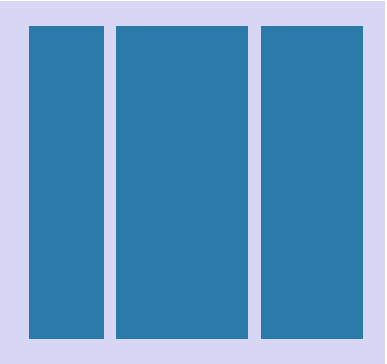

# Linear Layout

[Overview](#overview)<br>
[Orientation](#orientation)<br>
[Alignment](#alignment)<br>
[CellPadding](#cellpadding)<br>
[Weight](#weight)<br>


<a name="overview"></a>
## Overview

<table style="width:100%">
<tr>
<td style="width:100%" align="center">

</td>
</tr>
</table>

`LinearLayout` is a linear box layout, automatically handling children laid out vertically or horizontally. You can set the layout direction vertically or horizontally by using `LinearOrientation` property.

Positioning children in a linear form, one after the other, `CellPadding` can be provided to insert a space between each child. Unlike generic padding, this will not result in a space at the start, end or top, bottom of the layout.

`LinearAlignment` defines where the children should start being positioned from, and it's very useful if the children do not use all the space of the parent.

| Property               | Type            | Description  |
| -----------------------| --------------- | ------------ |
| `LinearOrientation`    | LinearLayout.Orientation | Gets/Sets Orientation of the linear layout : vertical or horizontal |
| `LinearAlignment`      | LinearLayout.Alignment  | Gets/Sets the global child alignment to be used |
| `CellPadding`          | Size2D      | Gets/Sets Spacing between the cells : horizontal space and vertical space |


<a name="orientation"></a>
## Orientation

A `LinearOrientation` indicates the direction of children layouts : horizontal or vertical. The default value is Horizontal.

| Horizontal | Vetical |
| -----------------------| --------------- |
|  |   |

```csharp
View layoutView = new View();
var linearLayout = new LinearLayout();
linearLayout.LinearOrientation = LinearLayout.Orientation.Horizontal;
layoutView.Layout = layout;
```


<a name="alignment"></a>
## Alignment

A `LinearAlignment` handles how Layout items are positioned within their parent Layout in the space. By default, items are aligned at the Top and Begin.

You can choose from the below alignment options.

| Alignment  | Info        |
| ---------- | ----------- |
| Begin      | At the left/right edge of the container (according to LTR/RTL direction for horizontal orientation) |
| End        | At the right/left edge of the container (according to LTR/RTL direction for horizontal orientation) |
| CenterHorizontal | At the horizontal center of the container (Vetical will be set to top) |
| Top        | At the top edge of the container |
| Bottom     | At the bottom edge of the container |
| CenterVertical | At the vertical center of the container (Horizontal will be set to start) |
| Center    | At both the vertical and horizontal center of the container |

<table style="width:100%">
<tr>
<td style="width:100%" align="center">

</td>
</tr>
</table>

```csharp
View layoutView = new View();
var linearLayout = new LinearLayout();
linearLayout.LinearAlignment = LinearLayout.Alignment.Center;
layoutView.Layout = layout;
```


<a name="cellpadding"></a>
## CellPadding

A `CellPadding` is to set the padding between cells in the layout.

<table style="width:100%">
<tr>
<td style="width:100%" align="center">

</td>
</tr>
</table>


```csharp
View layoutView = new View();
var linearLayout = new LinearLayout();
linearLayout.CellPadding = new Size2D(10, 20);
layoutView.Layout = layout;
```

<a name="weight"></a>
## Weight

A `Weight` is used to share available space in a layout with siblings.

Depending on each weight, children take up their Parent view's space. So, child views can set a `Weight` as float type. Default weight value is zero.

<table style="width:100%">
<tr>
<td style="width:100%" align="center">

</td>
</tr>
</table>

```csharp
View layoutView = new View();
var linearLayout = new LinearLayout();
layoutView.Layout = layout;

ImageView imageView1 = new ImageView();
imageView1.Weight = 0.75f;

ImageView imageView2 = new ImageView();
imageView2.Weight = 0.25f;

view.Add(imageView1);
view.Add(imageView2);
```


## Related information

- Dependencies
  -  Tizen 5.5 and Higher
