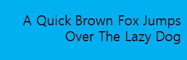

# Text

There are three NUI components for displaying text on the screen.

- The [TextLabel](#textLabel) is a NUI component that displays a short text string

- The [TextField](#textField) is a NUI component that allows single line text editing.

- The [TextEditor](#textEditor) is a NUI component that allows multi line text editing. It is similar to the TextField component.

<a name="textLabel"></a>
# TextLabel

A text label is a NUI component that displays a short text string. It is implemented through the `Tizen.NUI.BaseComponents.TextLabel` class.

Text labels are lightweight, non-editable, and do not respond to user input. They can support multiple languages and scripts, including right-to-left scripts, such as Arabic. For an example of displaying text using a text label, see [NUI Hello World Tutorial](hello-world.md).

**Figure: Text label example, positioned to top left**


<a name="create"></a>
## Creating a Text Label

To create a text label:

1.  Create an instance of the [Tizen.NUI.BaseComponents.TextLabel](https://samsung.github.io/TizenFX/latest/api/Tizen.NUI.BaseComponents.TextLabel.html) class and define the label text as a parameter:

    ```
    TextLabel label = new TextLabel("Hello World");
    ```

    You can also create the `Tizen.NUI.BaseComponents.TextLabel` class instance separately and define the label text by setting its `Text` property:

    ```
    TextLabel label = new TextLabel();
    label.Text = "Hello World";
    ```

    > **Note**
    > To display properly, the `Text` property must be a UTF-8 string. Any `CR+LF` new line characters are replaced by `LF`.

2.  Define the label position on-screen with the `ParentOrigin` property of the `Tizen.NUI.BaseComponents.TextLabel` class:

    ```
    label.ParentOrigin = ParentOrigin.TopLeft;
    ```

3.  Add the text label control to a window:

    ```
    Window window = Window.Instance;
    window.Add(label);
    ```

    > **Note**
    > A text label control can only be added to a window, or to a view that is on a window.

<a name="font"></a>
## Selecting Fonts

You can request a specific font using the `FontFamily`, the `FontStyle`, and the `PointSize` properties of the [Tizen.NUI.BaseComponents.TextLabel](https://samsung.github.io/TizenFX/latest/api/Tizen.NUI.BaseComponents.TextLabel.html) class:

-   `FontFamily` is a string with the font family name, for example, `FreeSerif`.
-   `FontStyle` is a JSON-formatted string with the font style. The following list describes some possible keys and common values for them:
    -   The `width` key defines the spacing between glyphs. Some commonly-used values include `condensed`, `semiCondensed`, `normal`, `semiExpanded`, and `expanded`.
    -   The `weight` key defines the thickness or darkness of the glyphs. Some commonly-used values include `thin`, `light`, `normal`, `regular`, `medium`, and `bold`.
    -   The `slant` key defines whether to use italics. Some commonly-used values include `normal` or `roman`, `italic`, and `oblique`.

        Usually `italic` is a separate font, while `oblique` is generated by applying a slant to the `normal` font.

-   `PointSize` is a float with the font size in points. To calculate the point size from the height in pixels, use the following formula, where `vertical_dpi` is the device's vertical resolution in dots per inch:

    ```
    point_size = 72 * pixels / vertical_dpi
    ```

The following example code specifies font properties:

```
label.FontFamily = "FreeSerif";

PropertyMap fontStyle = new PropertyMap();
fontStyle.Add("weight", new PropertyValue("bold"));
fontStyle.Add("slant", new PropertyValue("italic"));
label.FontStyle = fontStyle;
label.PointSize = 12.0f;
```

If no font is specified, styling defaults are used, and a suitable font for displaying the text label is automatically selected from the platform. However, it is possible that the automatically-selected font cannot render all the characters contained within the text label. For example, Latin fonts often do not provide Arabic glyphs.

### Font Styles

Setting a font size programmatically is not ideal for applications which support multiple screen resolutions, and for platforms which support multiple logical font sizes. Also, any changes made to the platform font settings override sizes that have been programmatically set.

A more flexible approach is to prepare various JSON stylesheets and request a different style for each platform. The [Tizen.NUI.NUIApplication](https://samsung.github.io/TizenFX/latest/api/Tizen.NUI.NUIApplication.html) class has constructors which take a stylesheet argument:

```
class Example : NUIApplication

Example example = new Example("example-path/example.json");
```

To change the font for standard text controls, the following JSON syntax can be used:

```
{
   "styles":
   {
      "textlabel":
      {
         "fontFamily": "FreeSerif",
         "fontStyle":
         {
            "weight": "bold",
            "slant": "italic"
         },
         "pointSize": 8
      }
   }
}
```

However, the same `pointSize` is unlikely to be suitable for all text controls in an application. To define custom styles for existing controls, simply set a style name for each case, and provide a style override in a JSON stylesheet.

You can provide further flexibility for the various screens by mapping the logical size to a physical size in the stylesheet.

<a name="align"></a>
## Aligning Text

To align the text in a text label:

-   To enable text wrapping, use the `MultiLine` property of the [Tizen.NUI.BaseComponents.TextLabel](https://samsung.github.io/TizenFX/latest/api/Tizen.NUI.BaseComponents.TextLabel.html) class:

    ```
    label.MultiLine = true;
    ```

-   To align the text horizontally to the beginning, center, or end of the available area, set the `HorizontalAlignment` property of the `Tizen.NUI.BaseComponents.TextLabel` class with the corresponding value of the [Tizen.NUI.HorizontalAlignment](https://samsung.github.io/TizenFX/latest/api/Tizen.NUI.HorizontalAlignment.html) enumeration:

    ```
    label.HorizontalAlignment = HorizontalAlignmentType.Begin;
    label.HorizontalAlignment = HorizontalAlignmentType.Center;
    label.HorizontalAlignment = HorizontalAlignmentType.End;
    ```

    The following table illustrates the available values of the `Tizen.NUI.HorizontalAlignment` enumeration for both left-to-right (Latin) and right-to-left (Arabic) script.

    |  Alignment  | Left-to-right script example    |      Right-to-left script example |
    |-------------|---------------------------------|-----------------------------------|
    |  `Begin` |    |   |
    |`Center` |   |  |
    | `End`   |   |    |


  The above examples assume that the label size is greater than the minimum required.

<a name="decorations"></a>
## Using Decorations

For text decorations, the [Tizen.NUI.BaseComponents.TextLabel](https://samsung.github.io/TizenFX/latest/api/Tizen.NUI.BaseComponents.TextLabel.html) class provides several properties. All properties are writable and none are animatable.

**Table: Text label properties**

| Property    |    Type |      Description |
|-------------|---------|------------------|
| `Text` |  `string` |     Text to display in UTF-8 forma.|
| `FontFamily` | `string` |   To use the font family. |
|  `FontStyle` |  `Map` |      To use the font style. |
|  `PointSize` |  `float` |     The font size in points. |
|  `MultiLine` |  `bool`  |     Whether to use the multi line layout option. |
|  `HorizontalAlignment` | `string` | The horizontal line alignment. |
|  `VerticalAlignment` | `string` | The vertical line alignment. |
| `TextColor`  |   `Color` |  The color of the text. |
|  `ShadowOffset` | `Vector2` |  The shadow offset of the text. |
|  `ShadowColor` | `Vector4`  |  The shadow color of the text. |
| `UnderlineEnabled` | `bool` |  Whether to use underline. |
| `UnderlineColor` | `Vector4` | The Underline color of the text. |
| `UnderlineHeight` |  `float` |  The height of the Underline height. |
|  `EnableMarkup` |  `bool` |  Enable the Markup string, to process text within the Markup tags using DALi application.<br>**Note**: By default, the Markup string is disabled. |
| `EnableAutoScroll` |  `bool` | Enable or disable the auto scrolling. |
| `AutoScrollSpeed` | `int`  | The scrolling speed is in pixels per second. |
| `AutoScrollLoopCount` | `int` |   Number of complete loops to scroll, when scrolling is enabled. |
| `AutoScrollGap` | `float` |   The gap before scrolling wraps. |
| `LineSpacing` |   `float` | The default spacing between lines in points. |
|  `Underline` |   `Map`  |    The default underline parameters. |
| `Shadow` | `Map` |      The default shadow parameters. |
|  `Emboss` |  `Map`  |         The default emboss parameters. |
| `Outline` |  `Map`  |         The default outline parameters. |
| `PixelSize` |  `float`  |       The size of font in pixels. |
| `Ellipsis` |   `bool` |      Enable or disable ellipsis, if required. |
| `AutoScrollLoopDelay` | `float` |   Auto scroll loop delay. |
| `AutoScrollStopMode` | `AutoScrollStopMode` | Auto-scroll stop mode |

To use the decorations, simply set the applicable property:

-   To change the color of the text, use the `TextColor` property:

    ```
    label.Text = "Red Text";
    label.TextColor = Color.Red;
    ```

    **Figure: Colored text**

    

-   To add a drop shadow to the text, set the `Shadow` property:

    ```
    window.BackgroundColor(Color.Blue);

    label1.Text = "Plain Text";

    label2.Text = "Text with Shadow";
    PropertyMap shadow = new PropertyMap();
    shadow.Add("offset", new PropertyValue("1 1"));
    shadow.Add("color", new PropertyValue("black"));
    pixelLabel.Shadow = shadow;

    label3.Text = "Text with Bigger Shadow";
    PropertyMap shadow = new PropertyMap();
    shadow.Add("offset", new PropertyValue("2 2"));
    shadow.Add("color", new PropertyValue("black"));
    label3.Shadow = shadow;

    label4.Text = "Text with Color Shadow";
    PropertyMap shadow = new PropertyMap();
    shadow.Add("offset", new PropertyValue("1 1"));
    shadow.Add("color", new PropertyValue("red"));
    label4.Shadow = shadow;
    ```

    **Figure: Text with drop shadow (top), bigger shadow (middle), and color shadow (bottom)**

    

    

    

    Shadow parameters can also be set using a JSON string.

-   To underline the text label, set the `Underline` property:

    ```
    label1.Text = "Text with Underline";

    PropertyMap textStyle = new PropertyMap();
    textStyle.Add("enable", new PropertyValue("true"));
    label1.Underline = textStyle;
    ```

    **Figure: Text with underline**

    

    You can set the underline color and height using a property map:

    ```
    label2.Text = "Text with Color Underline";

    PropertyMap textStyle = new PropertyMap();
    textStyle.Add("enable", new PropertyValue("true"));
    textStyle.Add("color", new PropertyValue(Color.Green));
    label2.Underline = textStyle;
    ```

    **Figure: Text with color underline**

    

    By default, the underline height is based on the font metrics. For example, the underline text figures above have a 1 pixel height. You can also specify the height you want:

    ```
    PropertyMap textStyle = new PropertyMap();
    textStyle.Add("enable", new PropertyValue("true"));
    textStyle.Add("height", new PropertyValue(2.0f)); /// 2-pixel height
    label1.Underline = textStyle;
    ```
<a name="scrolling"></a>
-   To enable text scrolling, set the `EnableAutoScroll` property to `true`:

    ```
    label.EnableAutoScroll = true;
    ```

    Once enabled, scrolling continues until the loop count is reached, or `EnableAutoScroll` is set to `false`. When `EnableAutoScroll` is set to `false`, the text completes its current scrolling loop before stopping.

    **Figure: Auto-scrolling text**

    

    Auto-scrolling enables text to scroll within the text table. You can use it to show the full content, if the text exceeds the boundary of the control. You can also scroll text that is smaller than the control. To ensure that the same part of the text is not visible in more than one place at the same time, you can configure the gap between repetitions. The left-to-right text always scrolls left and the right-to-left text scrolls right.

    The scroll speed, gap, and loop count can be set in the stylesheet, or through the following properties:

    -   `AutoScrollSpeed` property defines the scrolling speed in pixels/second.
    -   `AutoScrollLoopCount` property specifies how many times the text completes a full scroll cycle. For example, if this property is 3, the text scrolls across the control 3 times and then stops. If this property is 0, scrolling continues until `EnableAutoScroll` is set to `false`.

        Setting `EnableAutoScroll` to `false` stops scrolling, whilst maintaining the original loop count value for the next start.

    -   `AutoScrollGap` property specifies the amount of whitespace, in pixels, to display before the scrolling text is shown again. This gap is automatically increased if the given value is not large enough to prevent the same part of the text from being visible twice at the same time.

    Auto-scrolling does not work with multi-line text; it is shown with the `Begin` alignment instead.

<a name="markup"></a>
## Using Markup Styling

You can use markup elements to change the style of the text. Since the text controls do not process markup elements by default, you must first set the `EnableMarkup` property of the [Tizen.NUI.BaseComponents.TextLabel](https://samsung.github.io/TizenFX/latest/api/Tizen.NUI.BaseComponents.TextLabel.html) class to `true`:

```
TextLabel label = new TextLabel("Hello World");
label.EnableMarkup = true;
```

> **Note**
> The markup processor does not check for markup validity, and styles are rendered in a priority order. Incorrect or incompatible elements can cause the text to be badly rendered.

The following markup elements are currently supported:

-   `<color>`

    Sets the color for the characters inside the element, using the `value` attribute to define the color. The supported attribute values are `red`, `green`, `blue`, `yellow`, `magenta`, `cyan`, `white`, `black`, and `transparent`. Web colors and colors defined in 32-bit hexadecimal `0xAARRGGBB` format are also supported.

    The following examples both create text in red:

    ```
    label.Text = "<color value='red'>Red Text</color>"; /// Color coded with a text constant
    ```

    ```
    label.Text = "<color value='0xFFFF0000'>Red Text</color>"); /// Color packed inside an ARGB hexadecimal value
    ```

-   `<font>`

    Sets the font values for the characters inside the element.

    The following attributes are supported:

    -   `family`: Font name
    -   `size`: Font size in points
    -   `weight`: Font weight
    -   `width`: Font width
    -   `slant`: Font slant

    For more information on the attribute values, see [Selecting Fonts](#font).

    The following example sets the font family and weight:

    ```
    label.Text = "<font family='SamsungSans' weight='bold'>Hello world</font>";
    ```


<a name="textField"></a>
# TextField

The `TextField` class provides a control that allows single line editable text field.

**Figure: TextField**


In this tutorial, the following subjects are covered:

[TextField events](#textField1)<br>
[Creating a TextField](#textField2)<br>
[Aligning Text](#textField3)<br>
[TextField Properties](#textField4)<br>

<a name="textField1"></a>
## TextField events

The following table lists the basic signals provided by the `TextField` class.

**Table: TextField input signals**

| Input signal        | Description                                 |
| ------------------- | ------------------------------------------- |
| `TextChanged`       | Emitted when the text changes.              |
| `MaxLengthReached`  | Emitted when the inserted text exceeds the maximum character limit. |

<a name="textField2"></a>
## Creating a TextField

Before text has been entered, the `TextField` class displays a placeholder text. An alternative placeholder is displayed when the `TextField` has keyboard focus. For example, a TextField is used to enter a username can initially show the text `Unknown Name` and the text `Enter Name`, when the cursor is visible.

The following basic example illustrates creation of a `TextField` object:

```
Window window = Window.Instance;
TextField field = new TextField();
PropertyMap propertyMap = new PropertyMap();
propertyMap.Add("placeholderText", new PropertyValue("Unnamed Name"));
propertyMap.Add("placeholderTextFocused", new PropertyValue("Enter Name."));
field.Placeholder = propertyMap;
window.Add(field);
```

When the `TextField` is tapped, it automatically gets the keyboard focus. Key events enter the text. Additionally, the placeholder text is removed. After text has been entered, it can be retrieved from the `TEXT` property.

```
Property::Value fieldText = field.GetProperty( TextField::Property::TEXT );
std::string fieldTextString = fieldText.Get< std::string >();
```

<a name="textField3"></a>
## Aligning Text

The `TextField` class displays a single line of text, which scrolls for either of the following:

-  If there is not enough space for the text displayed.

-  If there is enough space, the text is aligned horizontally to the beginning, end, or center of the available area.

The code illustrates alignment of the text:

```
// Begin, Center, or End
field.HorizontalAlignment = HorizontalAlignment.Begin;
```

<a name="textField4"></a>
## TextField Properties
### Using Decorations

For text decorations, the following [Tizen.NUI.BaseComponents.TextField](https://samsung.github.io/TizenFX/latest/api/Tizen.NUI.BaseComponents.TextField.html) class properties are available. All properties are writable and none are animatable:

**Table: TextField properties**

| Property                           | Type        | Description                              |
| ---------------------------------- | ----------- | ---------------------------------------- |
| `Text`                             | String      | The text to display in UTF-8 format.     |
| `PlaceholderText`                  | String      | The text to display when the TextField is empty and inactive. |
| `PlaceholderTextFocused`           | String      | The text to display when the TextField is empty with key-input focus. |
| `FontFamily`                       | String      | The requested font family.               |
| `FontStyle`                        | PropertyMap | The requested font style.                |
| `PointSize`                        | Float       | The size of font in points.              |
| `MaxLength`                        | Integer     | The maximum number of characters that can be inserted. |
| `ExceedPolicy`                     | Integer     | Specifies how the text is truncated when it does not fit. |
| `HorizontalAlignment`              | HorizontalAlignment | The horizontal line alignment.   |
| `VerticalAlignment`                | VerticalAlignment   | The vertical line alignment.     |
| `TextColor`                        | Color       | The color of the text.                          |
| `PlaceholderTextColor`             | Vector4     | Set the color of the placeholder text.              |
| `PrimaryCursorColor`               | Vector4     | The color to apply to the primary cursor. |
| `SecondaryCursorColor`             | Vector4     | The color to apply to the secondary cursor. |
| `EnableCursorBlink`                | Boolean     | Enable or disable the cursor blink.    |
| `CursorBlinkInterval`              | Float       | The time interval in seconds between the cursor on or off states. |
| `CursorBlinkDuration`              | Float       | The cursor will stop blinking after this number of seconds. |
| `CursorWidth`                      | Integer     | The width of the cursor.                        |
| `GrabHandleImage`                  | String      | The image to display for the grab handle. |
| `GrabHandlePressedImage`           | String      | The image to display when the grab handle is pressed. |
| `ScrollThreshold`                  | Float       | Horizontal scrolling will occur, if the cursor is closer to the control border. |
| `ScrollSpeed`                      | Float       | The scroll speed is in pixels per second.   |
| `SelectionHandleImageLeft`         | PropertyMap | The image to display for the left selection handle. |
| `SelectionHandleImageRight`        | PropertyMap | The image to display for the right selection handle. |
| `SelectionHandlePressedImageLeft`  | PropertyMap | The image to display for the left selection handle marker. |
| `SelectionHandlePressedImageRight` | PropertyMap | The image to display for the right selection handle marker. |
| `SelectionHandleMarkerImageLeft`   | PropertyMap | The image to display for the left selection handle marker. |
| `SelectionHandleMarkerImageRight`  | PropertyMap | The image to display for the right selection handle marker. |
| `SelectionHighlightColor`          | Vector4     | The color of the selection is highlighted.    |
| `DecorationBoundingBox`            | Rectangle   | The decorations (handles etc) within the on-screen area will be positioned. |
| `InputMethodSettings`              | PropertyMap | The settings related to the System's Input Method, Key and Value. |
| `InputColor`                       | Vector4     | The color of the new input text.         |
| `EnableMarkup`                     | Boolean     | Enable the Markup string, to process text within the Markup tags using DALi application.<br>**Note**: By default, the Markup string is disabled. |
| `InputFontFamily`                  | String      | The font's family of the new input text. |
| `InputFontStyle`                   | PropertyMap | The font's style of the new input text.  |
| `InputPointSize`                   | Float       | The font's size of the new input text in points. |
| `Underline`                        | PropertyMap | The default underline parameters.        |
| `InputUnderline`                   | String      | The underline parameters of the new input text. |
| `Shadow`                           | PropertyMap | The default shadow parameters.            |
| `InputShadow`                      | String      | The shadow parameters of the new input text. |
| `Emboss`                           | PropertyMap | The default emboss parameters.           |
| `InputEmboss`                      | String      | The emboss parameters of the new input text. |
| `Outline`                          | PropertyMap | The default outline parameters.          |
| `InputOutline`                     | String      | The outline parameters of the new input text. |
| `HiddenInputSettings`              | PropertyMap | Hides the input characters and instead shows a default character for password or pin entry. |
| `PixelSize`                        | Float       | The size of font in pixels.              |
| `EnableSelection`                  | Boolean     | Enable or disable the text selection.                  |
| `Placeholder`                      | PropertyMap | Sets the placeholder for text, color, font family, font style, point size, and pixel size. |
| `Ellipsis`                         | Boolean     | Enable or disable ellipsis, if required. |
| `TranslatablePlaceholderText`      | String      | The TranslatablePlaceholderText property can set the SID value. |
| `TranslatableText`                 | String      | The TranslatableText property can set the SID value. |


<a name="textEditor"></a>
# TextEditor

The `TextEditor` class provides a control that allows multi line text editing. It is similar to the [TextField](#textField) control, where a different formatting can be applied to different parts of the text. You can change, for example, the font color, font style, point size, and font family.

The `TextEditor` also supports markup, and text can be scrolled vertically within it.

**Figure: TextEditor**


In this tutorial, the following subjects are covered:

[TextEditor events](#textEditor1)<br>
[Creating a TextEditor](#textEditor2)<br>
[TextEditor Properties](#textEditor3)<br>

<a name="textEditor1"></a>
## TextEditor events

The following table lists the basic signals provided by the `TextEditor` class.

**Table: TextEditor input signals**

| Input signal         | Description                              |
| -------------------- | ---------------------------------------- |
| `TextChanged`        | Emitted when the text changes.           |
| `ScrollStateChanged` | Emitted when TextEditor scrolling is started or finished. |

<a name="textEditor2"></a>
## Creating a TextEditor

The following basic example shows how to create a `TextEditor` object:

```
// Create a TextEditor instance
Window window = Window.Instance;
TextEditor editor = new TextEditor();
editor.Position2D = new Position2D(10, 700);
editor.Size2D = new Size2D(400, 90);
editor.BackgroundColor = Color.Red;
editor.PointSize = 20;
editor.TextColor = Color.White;
editor.Text = "This is a multiline text.\n I can write several lines.\n"
window.Add(editor);
```

<a name="textEditor3"></a>
## TextEditor Properties

You can modify the `TextEditor` appearance and behavior through its properties.

The following table lists the available [Tizen.NUI.BaseComponents.TextEditor](https://samsung.github.io/TizenFX/latest/api/Tizen.NUI.BaseComponents.TextEditor.html) properties.

**Table: TextEditor properties**

| Property                           | Type        | Description                              |
| ---------------------------------- | ----------- | ---------------------------------------- |
| `Text`                             | String      | The text to display in UTF-8 format.      |
| `TextColor`                        | Vector4     | The color of the text.                           |
| `FontFamily`                       | String      | The requested font family.                |
| `FontStyle`                        | PropertyMap | The requested font style.                 |
| `PointSize`                        | Float       | The size of font in points.               |
| `HorizontalAlignment`              | String      | The horizontal line alignment.            |
| `ScrollThreshold`                  | Float       | Horizontal scrolling will occur, if the cursor is closer to the control border. |
| `ScrollSpeed`                      | Float       | The scroll speed is in pixels per second.    |
| `PrimaryCursorColor`               | Vector4     | The color to apply to the primary cursor. |
| `SecondaryCursorColor`             | Vector4     | The color to apply to the secondary cursor. |
| `EnableCursorBlink`                | Boolean     | Enable or disable the cursor blink.   |
| `CursorBlinkInterval`              | Float       | The time interval in seconds between cursor on or off states. |
| `CursorBlinkDuration`              | Float       | The cursor will stop blinking after this number of seconds. |
| `CursorWidth`                      | Integer     | The width of the cursor.                         |
| `GrabHandleImage`                  | String      | The image to display for the grab handle. |
| `GrabHandlePressedImage`           | String      | The image to display when the grab handle is pressed. |
| `SelectionHandleImageLeft`         | PropertyMap | The image to display for the left selection handle. |
| `SelectionHandleImageRight`        | PropertyMap | The image to display for the right selection handle. |
| `SelectionHandlePressedImageLeft`  | PropertyMap | The image to display for the left selection handle. |
| `SelectionHandlePressedImageRight` | PropertyMap | The image to display for the right selection handle. |
| `SelectionHandleMarkerImageLeft`   | PropertyMap | The image to display for the left selection handle marker. |
| `SelectionHandleMarkerImageRight`  | PropertyMap | The image to display for the right selection handle marker. |
| `SelectionHighlightColor`          | Vector4     | The color of the selection is highlighted.     |
| `DecorationBoundingBox`            | Rectangle   | The decorations (handles etc) within the on-screen area will be positioned. |
| `EnableMarkup`                     | Boolean     | Enable the Markup string, to process text within the Markup tags using DALi application.<br>**Note**: By default, the Markup string is disabled. |
| `InputColor`                       | Vector4     | The color of the new input text.          |
| `InputFontFamily`                  | String      | The font's family of the new input text.  |
| `InputFontStyle`                   | PropertyMap | The font's style of the new input text.   |
| `InputPointSize`                   | Float       | The font's size of the new input text in points. |
| `LineSpacing`                      | Float       | The default extra space between lines in points. |
| `InputLineSpacing`                 | Float       | The extra space between lines in points.  |
| `Underline`                        | PropertyMap | The default underline parameters.         |
| `InputUnderline`                   | String      | The underline parameters of the new input text. |
| `Shadow`                           | PropertyMap | The default shadow parameters.            |
| `InputShadow`                      | String      | The shadow parameters of the new input text. |
| `Emboss`                           | String      | The default emboss parameters.            |
| `InputEmboss`                      | String      | The emboss parameters of the new input text. |
| `Outline`                          | PropertyMap | The default outline parameters.           |
| `InputOutline`                     | String      | The outline parameters of the new input text. |
| `SmoothScroll`                     | Boolean     | Enable or disable the smooth scroll animation. |
| `SmoothScrollDuration`             | Float       | Sets the duration of smooth scroll animation. |
| `EnableScrollBar`                  | Boolean     | Enable or disable the scroll bar.         |
| `ScrollBarShowDuration`            | Float       | Sets the duration of scroll bar to show.  |
| `ScrollBarFadeDuration`            | Float       | Sets the duration of scroll bar to fade out. |
| `PixelSize`                        | Float       | The size of font in pixels.               |
| `LineCount`                        | Integer     | The line count of text.                   |
| `EnableSelection`                  | Boolean     | Enable or disable Text selection.                   |
| `Placeholder`                      | PropertyMap | Sets the placeholder : text, color, font family, font style, point size, and pixel size. |
| `LineWrapMode`                     | LineWrapMode | Line wrap mode when text lines are greater than the layout width. |
| `TranslatablePlaceholderText`      | String      | The TranslatablePlaceholderText property can set the SID value. |
| `TranslatableText`                 | String      | The TranslatableText property can set the SID value. |

