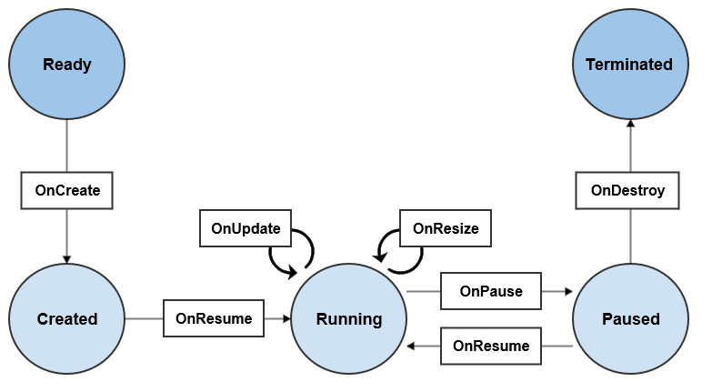

# Widget

You can create a widget application with NUI to display small version of application on the Home screen.

To create a NUI widget application, you must:

- Use the [NUIWidgetApplication](https://developer.tizen.org/dev-guide/csapi/api/Tizen.NUI.NUIWidgetApplication.html) class.

    > **Note**
    >
    > - The implementation of DALi widget application is similar to [NUIApplication](https://developer.tizen.org/dev-guide/csapi/api/Tizen.NUI.NUIApplication.html), because the [NUIWidgetApplication](https://developer.tizen.org/dev-guide/csapi/api/Tizen.NUI.NUIWidgetApplication.html) class inherits from the [CoreApplication](https://developer.tizen.org/dev-guide/csapi/api/Tizen.Applications.CoreApplication.html) class.

  > - Ensure you are familiar with the basic UI application details before tackling a widget application.

- Ensure you start the event loop.
- To implement your own widget class inherit the [Widget](https://developer.tizen.org/dev-guide/csapi/api/Tizen.NUI.Widget.html) class.

**Figure: NUI widget application**


For more information on basics of creating a NUI widget application, see [Creating a NUI Widget Application](#create-a-nui-widget-application).

## Application and Instance

If you want to use NUI for your widget application, you must create the application with the [NUIWidgetApplication](https://developer.tizen.org/dev-guide/csapi/api/Tizen.NUI.NUIWidgetApplication.html) class. This class provides the means for initializing the resources required by NUI.

The `NUIWidgetApplication` class provides the `NUIWidgetApplication( System.Type widgetType )` constructor, which allows a widget application to have widget class. 

| Function           | Description                                                                                   |
|--------------------|-----------------------------------------------------------------------------------------------|
| `NUIWidgetApplication( System.Type widgetType )`       | Create NUIWidgetApplication using type of widget    

The widget applications can make diverse class instances whenever widget viewer applications, such as the home screen and the lock screen, request for a widget instance.

Each widget application has 1 widget instances.
       

## Instance States and Events

**Figure: NUI widget flow**



`Widget` class provides interface for creating custom widget.

The table list the main functions to manage widget instance:

**Table: Main functions**

| Function           | Description                                                                                   |
|--------------------|-----------------------------------------------------------------------------------------------|
| `OnCreate()`       | This function is called after the widget instance is created.                                 |
| `OnTerminate()`    | This function is called after the widget instance is terminated.                              |
| `OnPause()`        | This function is called when the widget is invisible.                                         |
| `OnResume()`       | This function is called when the widget is visible.                                           |
| `OnResize()`       | This function is called before the widget size is changed.                                    |
| `OnUpdate()`       | This function is called when an event for updating the widget is received.                    |
| `SetContentInfo()` | This function sends data about current state of widget instance to a widget viewer application. |

Most of functions are used for managing widget instance lifecycle. You can describe what will be done on each lifecycle functions.

Widget instance can send data to widget viewer application using `SetContentInfo()` function. If you want to save the current state of widget before deleting it, view the current state of the widget and delete it.

## Create a NUI Widget Application
The steps to create a NUI widget application:

1. Define your widget application class, which is inherited from the [NUIWidgetApplication](https://developer.tizen.org/dev-guide/csapi/api/Tizen.NUI.NUIWidgetApplication.html) class:

   ```
   class Program : Tizen.NUI.NUIWidgetApplication
   ```

2. Create a the widget application
   
   The widget application starts with the `Main()` function, which creates and initializes the application. The `Run()` method of the [NUIWidgetApplication](https://developer.tizen.org/dev-guide/csapi/api/Tizen.NUI.NUIWidgetApplication.html) class is used to start the application event loop.

   The `NUIWidgetApplication` class provides constructors, which allows a widget application to have widget class:

   ```
    static void Main(string[] args)
    {
        var app = new Program(typeof(MyWidget));
        app.Run(args);
    }    
   ```

3. Define your widget class, which is inherited from the [Widget](https://developer.tizen.org/dev-guide/csapi/api/Tizen.NUI.Widget.html)

   ```
   class MyWidget : Tizen.NUI.Widget
   ```

4. Overide the event callback methods of your new class:

  - The `OnCreate()` callback is triggered when the widget instance is created.

     Initialize resources for this widget instance and draw the UI. If bundle content is not NULL, restore the previous status.

   
    ```
    class MyWidget : Tizen.NUI.Widget
    {
      protected override void OnCreate(string contentInfo, Window window)
      {
        /// Create the UI
        /// ....
        base.OnCreate(contentInfo, window);
      }
    }
    ```

  - The `OnTerminate()` callback is triggered when the widget instance is terminated.

      ```
      protected override void OnTerminate(string contentInfo, TerminationType type)
      ```

  - The `OnPause()` callback is triggered when the widget instance is paused.


      Take the necessary actions when the widget instance becomes invisible. The framework can destroy a paused widget instance.
      ```
      protected override void OnPause()
      ```

  - The `OnResume()` callback is triggered when the widget instance is resumed.

      Take the necessary actions when the widget instance becomes visible.

      ```
      protected override void OnResume()
      ```

  - The `OnResize()` callback is triggered when the widget instance is resized.

      Take the necessary actions to accommodate the new size.
      ```
      protected override void OnResize(Window window)
      ```

  - The `OnUpdate()` callback is triggered when a widget update event is received. 

      Take the necessary actions for the widget update. If the isForce parameter is true, the widget can be updated even in the pause state.
      ```
      protected override void OnUpdate(string contentInfo, int force)
      ```

5. Drawing the Widget UI in OnCreate()

      The widget UI is drawn in the `OnCreate()` callback of your widget class:

      ```
      protected override void OnCreate(string contentInfo, Window window)
      {
          View rootView = new View();
          rootView.BackgroundColor = Color.White;
          rootView.Size2D = window.Size;
          rootView.PivotPoint = PivotPoint.Center;
          window.GetDefaultLayer().Add(rootView);

          TextLabel sampleLabel = new TextLabel("Hello World!");
          sampleLabel.FontFamily = "SamsungOneUI 500";
          sampleLabel.PointSize = 71;
          sampleLabel.TextColor = Color.Black;
          sampleLabel.SizeWidth = 200;
          sampleLabel.PivotPoint = PivotPoint.Center;

          rootView.Add(sampleLabel);
      }
      ```

## Related Information
- Dependencies
  - Tizen 4.0 and Higher for Mobile
  - Tizen 4.0 and Higher for Wearable
