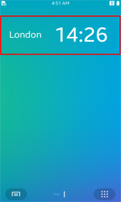
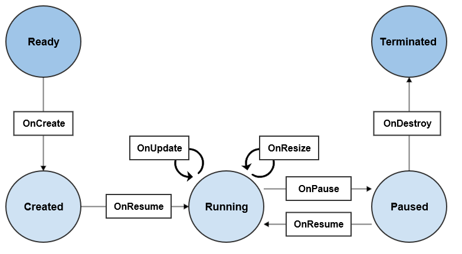

# NUI Widget Application

NUI Widget application is to show a small version of application on the home screen.

**Figure: NUI widget application**



<br>
The main Widget application features include:

- Creating widget applications

  You can [Create a NUI Widget Application](#create-a-nui-widget-application)
, which usually has 1 process for maintaining the main loop. Within the process, the framework can be create widget instance that can share the same resources.
  The Widget application can also share data with other applications.

- Managing widget instances
  
  Whenever a widget instance is requested, the framework creates one.
  You can manage the widget instances by updating or destroying them, or by retrieving information about them.

- Managing the life-cycle
  
  You can manage the widget instance life-cycle through callback methods that are triggered as the instance state changes.

- Creating the widget UI

  The widget application can draw a UI on the home screen.


    > **Note**
    >
    > The widget application UI has a limitation with the scroll action to provide a better user experience. Design the widget UI to display all the information within the given area of the screen points.
    >
    > To draw the UI, you must use the [Window](https://developer.tizen.org/dev-guide/csapi/api/Tizen.NUI.Window.html) received from the OnCreate Callback.  Do not create additional windows. A stack of widget application windows gets corrupted, because the platform handles the widget application window in a special way.

## Application and Instance

The widget applications can make diverse class instances whenever widget viewer applications, such as the home screen and the lock screen, request for a widget instance.

The widget instance has its own life-cycle similar to the widget application. However, the widget instance is only an object shown by the widget viewer applications. Many widget instances can be running on the same widget application process.

> **Note**
>
>The case to use many widget instances in one widget application is called multi-instance.
> This feature is only available on specific device. If the device does not support multi-instance,an error message is displayed.

## Instance States and Events
The following figure illustrates the widget instance states during the instance life-cycle:


**Figure: NUI widget flow**



`Widget` class provides interface for creating custom widget.

The table list the main functions to manage widget instance:

**Table: Main functions**

| Function           | Description                                                                                   |
|--------------------|-----------------------------------------------------------------------------------------------|
| `OnCreate()`       | This function is called after the widget instance is created.                                 |
| `OnTerminate()`    | This function is called after the widget instance is terminated.                              |
| `OnPause()`        | This function is called when the widget is invisible.                                         |
| `OnResume()`       | This function is called when the widget is visible.                                           |
| `OnResize()`       | This function is called before the widget size is changed.                                    |
| `OnUpdate()`       | This function is called when an event for updating the widget is received.                    |
| `SetContentInfo()` | This function sends data about current state of widget instance to a widget viewer application. |

Most of functions are used for managing widget instance lifecycle. You can describe what will be done on each lifecycle functions.

Widget instance can send data to widget viewer application using `SetContentInfo()` function. If you want to save the current state of widget before deleting it, view the current state of the widget and delete it.

## Create a NUI Widget Application

If you want to use NUI for your widget application, you must create the application with the [NUIWidgetApplication](https://developer.tizen.org/dev-guide/csapi/api/Tizen.NUI.NUIWidgetApplication.html) class. 
This class provides the `NUIWidgetApplication( Dictionary< Type, string > typeInfo ) ` constructor, which allows a widget application to have widget class. 

| Function           | Description                                                                                   |
|--------------------|-----------------------------------------------------------------------------------------------|
| `NUIWidgetApplication( Dictionary< Type, string > typeInfo ) `       | Create NUIWidgetApplication.

- To implement your own widget class inherit the [Widget](https://developer.tizen.org/dev-guide/csapi/api/Tizen.NUI.Widget.html) class.
- Use the [NUIWidgetApplication](https://developer.tizen.org/dev-guide/csapi/api/Tizen.NUI.NUIWidgetApplication.html) class.

    > **Note**
    >
    > - The implementation of DALi widget application is similar to [NUIApplication](https://developer.tizen.org/dev-guide/csapi/api/Tizen.NUI.NUIApplication.html), because the [NUIWidgetApplication](https://developer.tizen.org/dev-guide/csapi/api/Tizen.NUI.NUIWidgetApplication.html) class inherits from the [CoreApplication](https://developer.tizen.org/dev-guide/csapi/api/Tizen.Applications.CoreApplication.html) class.

  > - Ensure you are familiar with the basic UI application details before tackling a widget application.

The steps to create a NUI widget application:
1. To use the methods and properties of the [Tizen.NUI](https://samsung.github.io/TizenFX/latest/api/Tizen.NUI.html) namespace, include it in your application.

   ```csharp
   using Tizen.NUI;
   ```

2. Define your widget application class, which is inherited from the [NUIWidgetApplication](https://developer.tizen.org/dev-guide/csapi/api/Tizen.NUI.NUIWidgetApplication.html) class:

   ```csharp
   class Program : NUIWidgetApplication
   ```

3. Create the widget application
   
   The widget application starts with the `Main()` function, which creates and initializes the application. The `Run()` method of the [NUIWidgetApplication](https://developer.tizen.org/dev-guide/csapi/api/Tizen.NUI.NUIWidgetApplication.html) class is used to start the application event loop.

   The `NUIWidgetApplication` class provides constructors, which allows a widget application to have widget class:

   ```csharp
    static void Main(string[] args)
    {
        var app = new Program(typeof(MyWidget));
        app.Run(args);
    }    
   ```

4. Define your widget class, which is inherited from the [Widget](https://developer.tizen.org/dev-guide/csapi/api/Tizen.NUI.Widget.html)

   ```csharp
   class MyWidget : Widget
   ```

5. Overide the event callback methods of your new class:

  - The `OnCreate()` callback is triggered when the widget instance is created.

     Initialize resources for this widget instance and draw the UI. If bundle content is not NULL, restore the previous status.

   
    ```csharp
    class MyWidget : Tizen.NUI.Widget
    {
      protected override void OnCreate(string contentInfo, Window window)
      {
        /// Create the UI
        /// ....
        base.OnCreate(contentInfo, window);
      }
    }
    ```

  - The `OnTerminate()` callback is triggered when the widget instance is terminated.

      ```csharp
      protected override void OnTerminate(string contentInfo, TerminationType type)
      ```

  - The `OnPause()` callback is triggered when the widget instance is paused.


      Take the necessary actions when the widget instance becomes invisible. The framework can destroy a paused widget instance.
      ```csharp
      protected override void OnPause()
      ```

  - The `OnResume()` callback is triggered when the widget instance is resumed.

      Take the necessary actions when the widget instance becomes visible.

      ```csharp
      protected override void OnResume()
      ```

  - The `OnResize()` callback is triggered when the widget instance is resized.

      Take the necessary actions to accommodate the new size.
      ```csharp
      protected override void OnResize(Window window)
      ```

  - The `OnUpdate()` callback is triggered when a widget update event is received. 

      Take the necessary actions for the widget update. If the isForce parameter is true, the widget can be updated even in the pause state.
      ```csharp
      protected override void OnUpdate(string contentInfo, int force)
      ```

6. Drawing the Widget UI in OnCreate()

    The widget UI is drawn in the `OnCreate()` callback of your widget class:

    ```csharp
    protected override void OnCreate(string contentInfo, Window window)
    {
        View rootView = new View();
        rootView.BackgroundColor = Color.White;
        rootView.Size2D = window.Size;
        rootView.PivotPoint = PivotPoint.Center;
        window.GetDefaultLayer().Add(rootView);

        TextLabel sampleLabel = new TextLabel("Hello World!");
        sampleLabel.FontFamily = "SamsungOneUI 500";
        sampleLabel.PointSize = 71;
        sampleLabel.TextColor = Color.Black;
        sampleLabel.SizeWidth = 200;
        sampleLabel.PivotPoint = PivotPoint.Center;

        rootView.Add(sampleLabel);
    }
    ```

## Related Information
- Dependencies
  - Tizen 4.0 and Higher for Mobile
  - Tizen 4.0 and Higher for Wearable
